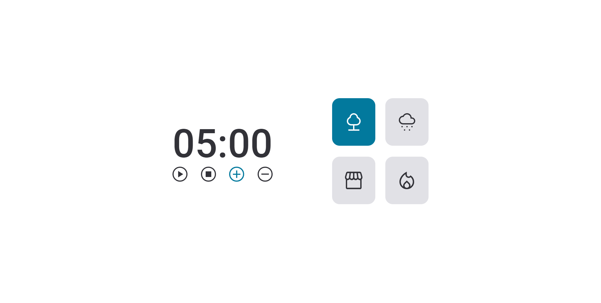

# "Focus Timer 2.0 - Pomodoro"

Project building from "Rocktseat" classes.

[Click here to access project](https://hudsonsena.github.io/DesafioProjeto08/)

# Technologies

- HTML
- CSS
- JavaScript
- Git e GitHub

# Learning

- SVG style edits controls and cards
- scripts(functions, events, constant, variables, window, if, else)
- audios aplications
- export and import
- factoring method
- application of dependencies
- clean code

# Contact

hudsonsena93@gmail.com